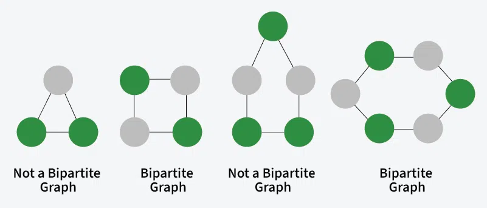

# BiPartite:-

A graph is bipartite if the nodes can be partitioned into two independent sets A and B such that every edge in the graph connects a node in set A and a node in set B.



odd length cycle cannot be a bipartite . \
Even length cycle wiil be a bipartite

**Analogy**:
Need to color the graph into 2 colors so gradually start from a node and color also color its neighboring vertices with opposite color at any time we get an color mismathc condition we return false

can do using both bfs and dfs

<details>
<summary>DFS</summary>

```python
graph = [[1,2,3],[0,2],[0,1,3],[0,2]]
#dfs
N = len(graph)
color = [-1]*N

for node in range(N):

    if color[node]!=-1:
        continue
    stack = [(node,-1)]
    color[node] = 0
    while stack:
        curr_node,parent = stack.pop()
        curr_color = color[curr_node]
        for neighbor in graph[curr_node]:
            if neighbor == parent:
                continue
            if color[neighbor] != -1:
                if curr_color == color[neighbor]:
                    return False
            else:
                color[neighbor] = 1 - curr_color
                stack.append((neighbor,curr_node))

return True


# recursive dfs
"""
def check_bipartite(curr_node,curr_color):
    color[curr_node] = curr_color
    for neighbor in graph[curr_node]:
        if color[neighbor] == curr_color:
            return False
        if color[neighbor] == -1 :
            if not check_bipartite(neighbor,1-curr_color):
                return False

    return True

for i in range (N):
    if color[i] == -1 :
        if not   check_bipartite(i,0):
            return False
"""
return True
```

</details>

<details>
<summary>BFS</summary>

```python
#bfs
N = len(graph)
BLACK = 0
WHITE = 1
GREY= 2
colors = [GREY]*N
#iterative
"""def color(start):
    queue = deque([start])
    colors[start] =    BLACK
    while queue:
        current = queue.popleft()
        for neighbor in graph[current]:
            if colors[neighbor] == colors[current]:
                return False

            if colors[neighbor] == GREY:
                if colors[current] ==  BLACK:
                    colors[neighbor] = WHITE
                else:
                    colors[neighbor] = BLACK
                queue.append(neighbor)

    return True


    for node in range(N):
    if colors[node] == GREY:
        colors[node] = BLACK
        if not color(node):
            return False
return True

"""

#recursive
def color(start):
    for neighbor in graph[start]:
        if colors[neighbor] == colors[start]:
            return False
        if colors[neighbor] == GREY:
            if colors[start] == BLACK:
                colors[neighbor] = WHITE
            else:
                colors[neighbor] = BLACK

            if not color(neighbor):
                return False
    return True
for node in range(N):
    if colors[node] == GREY:
        colors[node] = BLACK
        if not color(node):
            return False
return True

```

</details>

## Complexity:-

**TimeComplexity**

T.C:- O(2V+E) => .O(V) outer loop dfs/bfs visits each vertex and each edge one time so O(V+E)

             T.C:- O(V+E)

**Space Complexity**

             S.C:-O(V) for colors array

## Resources:-

- **[CodeStory With Mike DFS](https://youtu.be/NeU-C1PTWB8?si=RjC-zAFS6s1OSMaw)**

- **[Larry BFS ](https://youtu.be/I1NSpleDhQM?si=kUZLPz3oJnEKR_Ng)**
